# 安裝kind(mac os 為例)
請預先安裝brew docker

[brew安裝](https://brew.sh)
```shell
brew install kind
brew install docker
```

1. 架設一個3個節點的control-plane，以及2個節點worker
   - 參考官方文檔進行yaml撰寫
     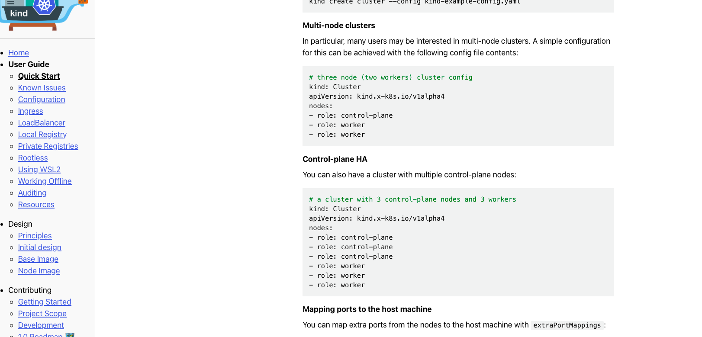
   - ```yaml
     # kind-config.yaml
     kind: Cluster
     apiVersion: kind.x-k8s.io/v1alpha4
     nodes:
       - role: control-plane
       - role: control-plane
       - role: control-plane
       - role: worker
       - role: worker
     ```
2. kind create cluster
   - ```shell
      kind create cluster --config kind-config.yaml
      ```
   - 創建完成
     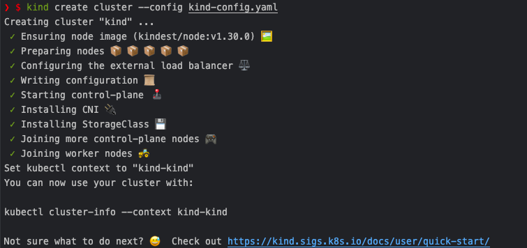

3. 查看是否有3個節點的control-plane，以及2個節點worker
   - 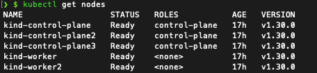


## 安裝 Prometheus, node exporter, kube-state-metrics 在kind的叢集裡，Prometheus 收集node exporter, kube-state-metrics的效能數據。
1. 先開好一個prometheus的namespace以作區分
    - ```shell
        kubectl create ns prometheus
      ```
2. node-exporter創建
    - ```shell
        kubectl apply -f node-exporter.yaml -n prometheus
      ```
    - 確認node-exporter是否已經啟動
    - ```shell
      kubectl get pods -n prometheus
      kubectl get daemonsets -n prometheus
      ```
    - 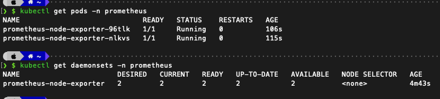
    啟動就緒
3. kube-state-metrics創建  
   - ```shell
     kubectl apply -f kube-state-metrics
     ```
   - 檢查是否已經啟動就緒
   - ```shell
     kubectl get pods -l app.kubernetes.io/name=kube-state-metrics -n kube-system
     ```
   - 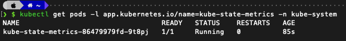
4. prometheus安裝
   - ```shell
     kubectl apply -f prometheus
     ```
5. 為了讓prometheus可供叢集外部連線 需開外對外連線目標
   > 根據教學使用loadbalancer開啟對外ip 須先安裝 [cloud-provider-kind](https://github.com/kubernetes-sigs/cloud-provider-kind?tab=readme-ov-file#install)  
   > 由於本台機器是mac 需要安裝本地版本的cloud-provider-kind 並且使用sudo執行檔案才可供叢及外部連線  
   > 安裝完成後可看到svc部分使用LoadBalancer能看到external-ip可進行訪問了
   > 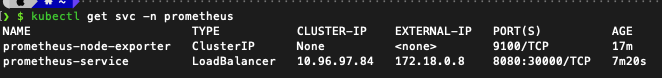
   > 嘗試訪問prometheus 並查看targets是否有東西 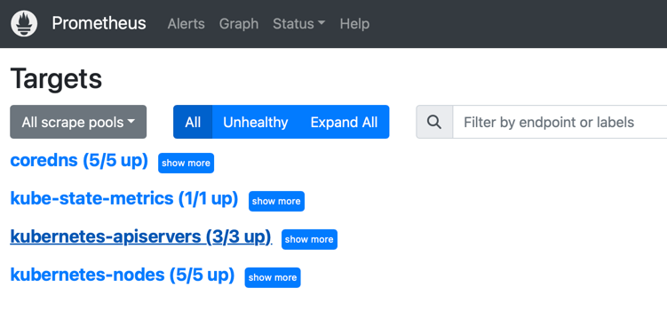
6. 安裝grafana
   - ```shell
     docker run -d --name grafana --network kind -p 3000:3000 grafana/grafana
     #network連跟kind一樣的 不然連不到prometheus
     ```
   > 訪問本地grafana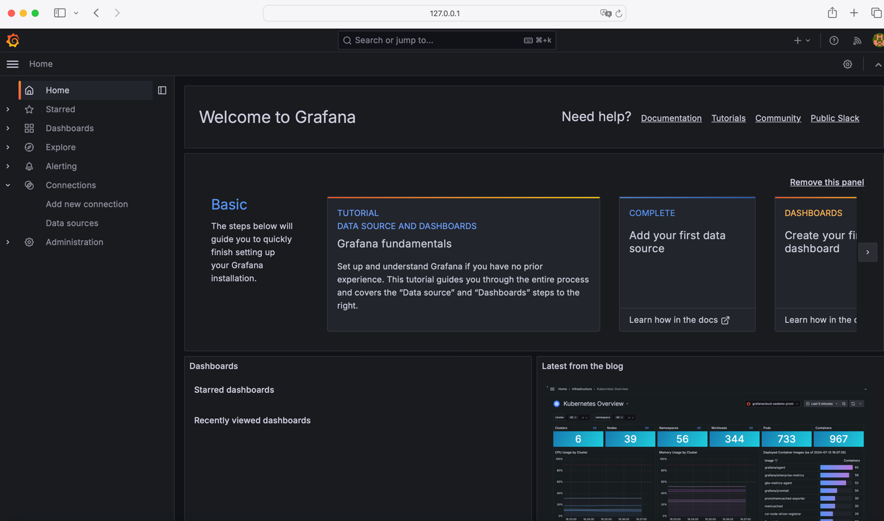
   > 設定連線到prometheus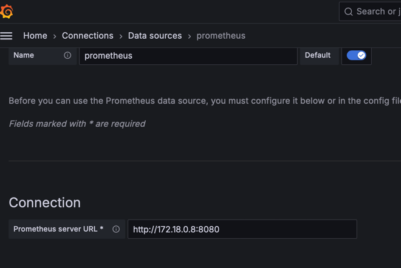
   > 連線成功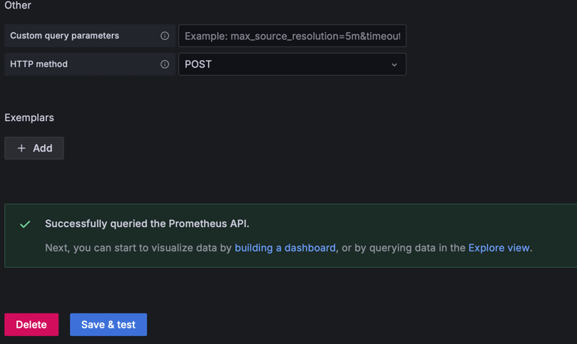

7. 效能監控儀表板
   - 呈現 node 的效能監控數據  
      > - 使用 Grafana 內建的 Node Exporter Full Dashboard  
      > - Dashboard ID: 1860  
      > - 可以在 Grafana 上進行搜尋並導入 
      > - 圖表說明 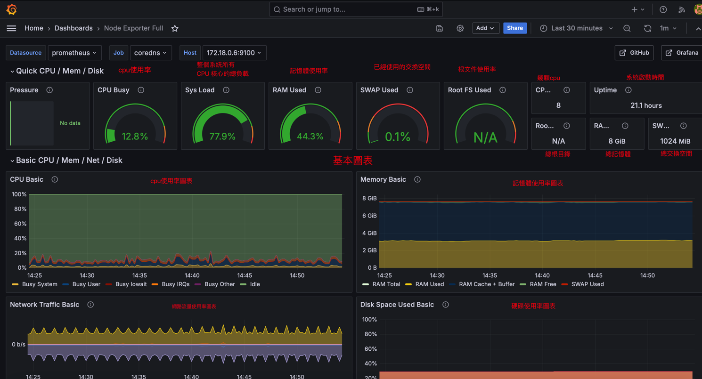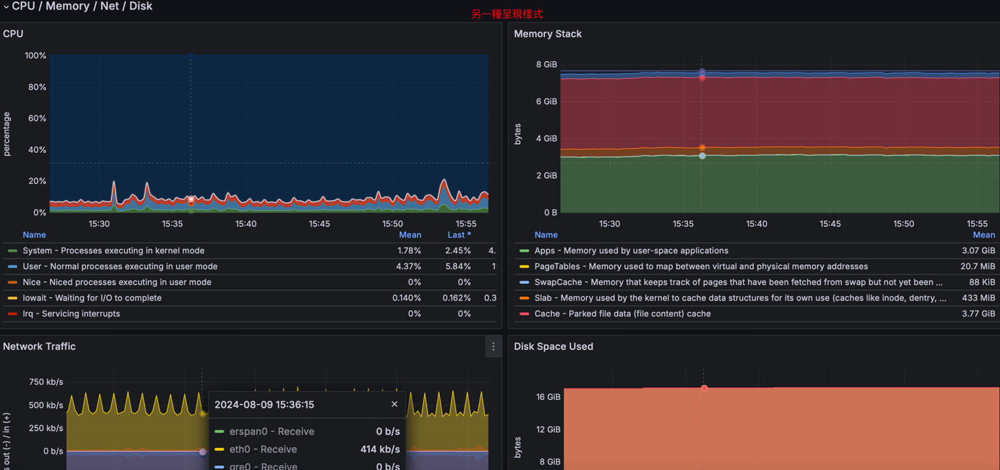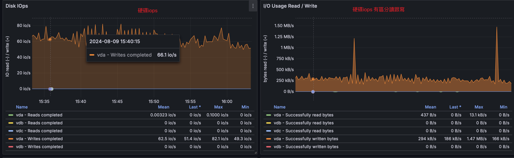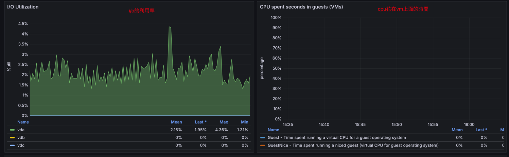
   - kind叢集監控
      > - 套用官方範本[範本](https://grafana.com/grafana/dashboards/315-kubernetes-cluster-monitoring-via-prometheus/)
      > - 圖表說明 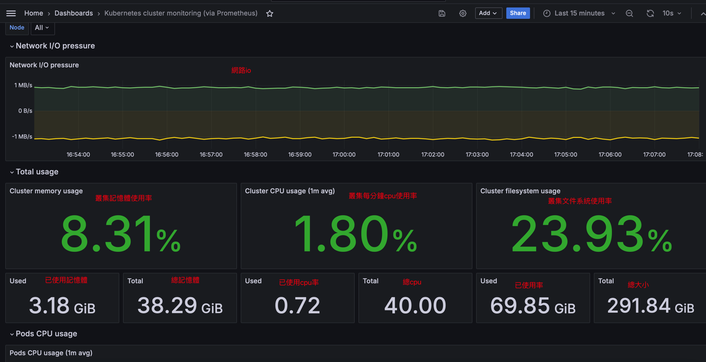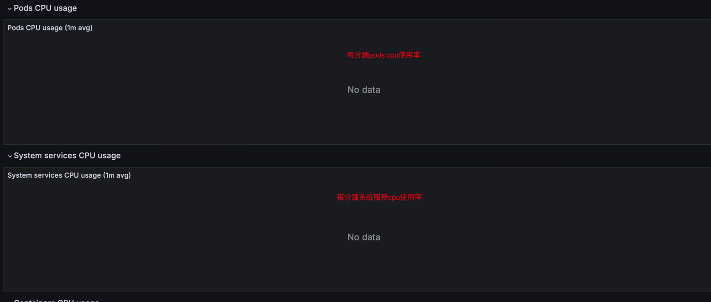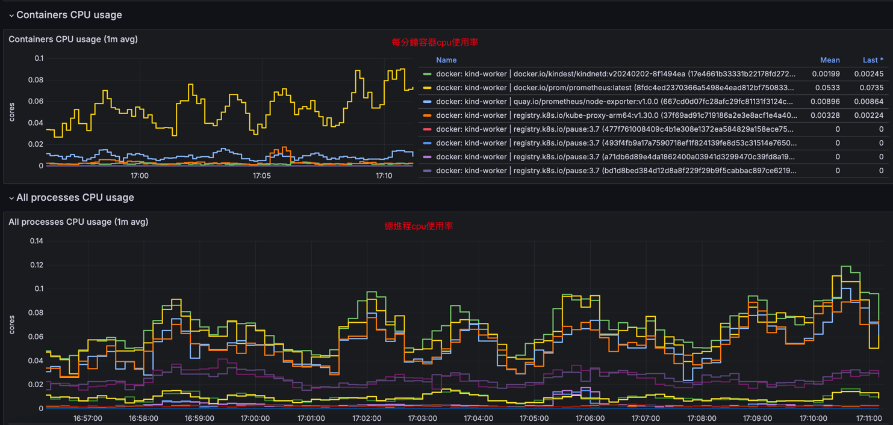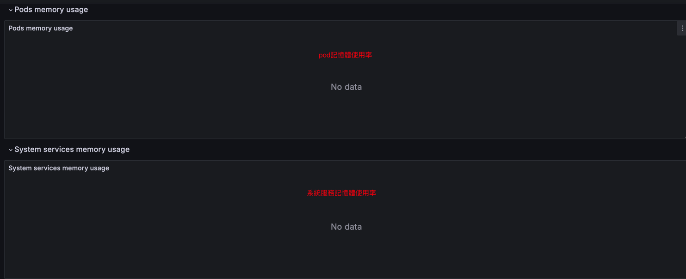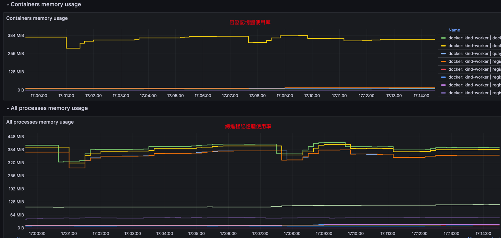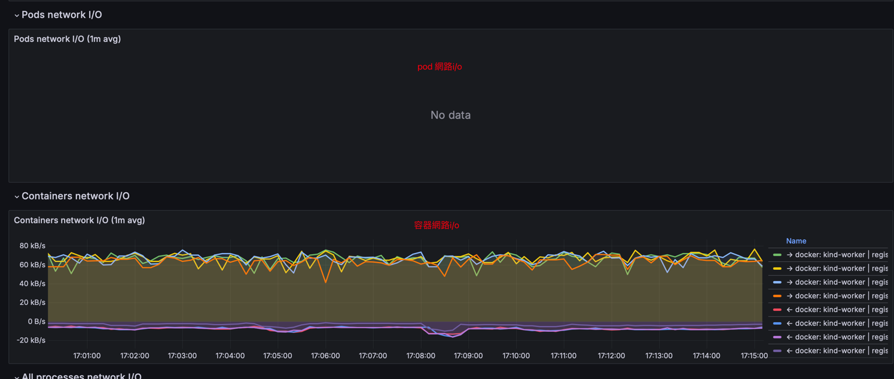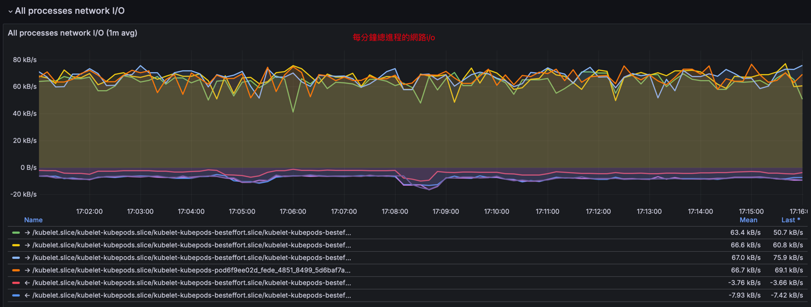
   - 請說明要如何透過建立的監控儀表板觀察 CPU Throttling 現象。
      > - 觀察container_cpu_cfs_throttled_seconds_total指標
      > - 另外拉一張圖表簡單拉個查詢
      > - 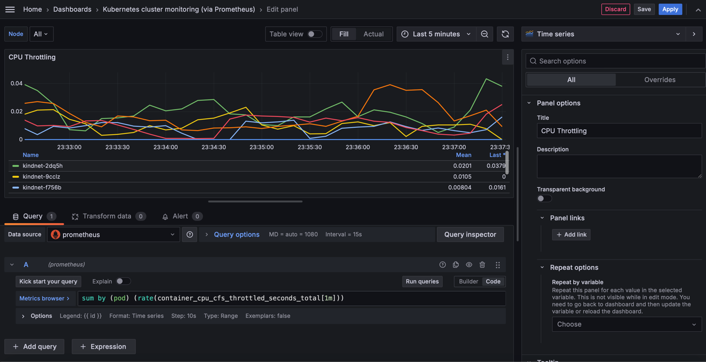
      > - 越接近0代表沒有受限制
# 請部署一個容器應用程式在 kind 叢集,建立一個 hpa 物件以 cpu 使用率到達 50%為條件,最多擴充到 10 個 pod。
1. 創建一個範例用的ns
   - 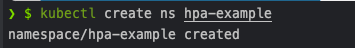
2. 先安裝metrics-server 確保metrics api可以使用  
   - ```shell
     kubectl apply -f metrics-server
     ```
     確保metrics server有在運作
   - 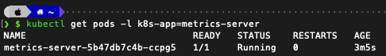
3. apply hpa-example裡面的yaml
   - ```shell
     kubectl apply -f hpa-example -n hpa-example
     ```
   - 檢查deployment是否有在運作
   > 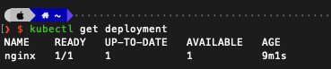
   - 檢查hpa是否有在運作
   > 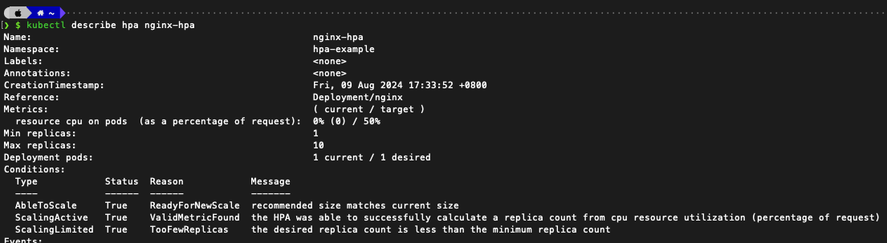